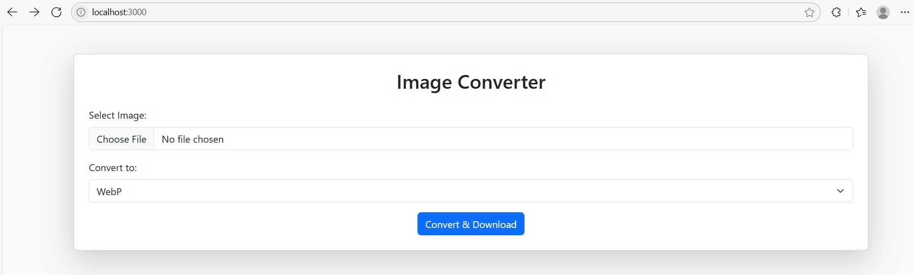

## Image Converter Microservice project:

## 📸 Screenshot




````markdown
# 🖼️ Image Converter Microservice

A simple Node.js microservice to convert uploaded images to different formats (`.jpg`, `.png`, `.webp`) using [Sharp](https://sharp.pixelplumbing.com/), [Express](https://expressjs.com/), and [Multer](https://github.com/expressjs/multer).


## 📸 Features

- Upload images through a web form
- Convert images to PNG, JPG, or WebP
- Automatically downloads the converted file
- Built-in frontend with Bootstrap 5
- Dockerized and easy to deploy


## 🧰 Tech Stack

- Node.js
- Express 5
- Sharp
- Multer
- Bootstrap (Frontend)
- Docker (Optional)


## 🚀 Getting Started

### 1. Clone the Repository

```bash
git clone https://github.com/Sneha24Sneha/Image-Converter.git
cd image-converter
````

### 2. Install Dependencies

```bash
npm install
```

### 3. Run the App

#### Development (with nodemon)

```bash
npm run dev
```

#### Production

```bash
npm start
```

Visit: [http://localhost:3000](http://localhost:3000)


## 📁 Project Structure

```
image-converter/
├── public/             # Static frontend (HTML form)
│   └── index.html
├── uploads/            # Temporary uploads (auto-created)
├── converted/          # Converted files (auto-created)
├── server.js           # Express server
├── Dockerfile          # For containerized deployment
├── package.json
└── README.md
```


## 🐳 Docker Support for Production

### Build the Image

```bash
docker build -t image-converter .
```

### Run the Container

```bash
docker run -p 3000:3000 image-converter
```


## 🐳 Docker Support for Development

### Build the Image

```bash
docker build -f Dockerfile.dev -t image-converter-dev .
```

### Run the Container

```bash
docker run -p 3000:3000 image-converter-dev
```

> For development with live-reloading, use a `Dockerfile.dev` and `docker-compose` (optional).


## ⚙️ API Endpoint

### `POST /convert`

Form Fields:

1) `image`: the uploaded image file
2) `format`: target format (`png`, `jpg`, or `webp`)

Response:

 Returns the converted image as a downloadable file.


## 🛡️ Notes

1) Make sure `uploads/` and `converted/` folders are writable (auto-created if missing).
2) Only accepts `image/*` MIME types via form input.
3) Sharp handles image decoding/encoding under the hood.


## 📄 License

[ISC](LICENSE)


## ✨ Author

Made by \ Sneha Sharma


```